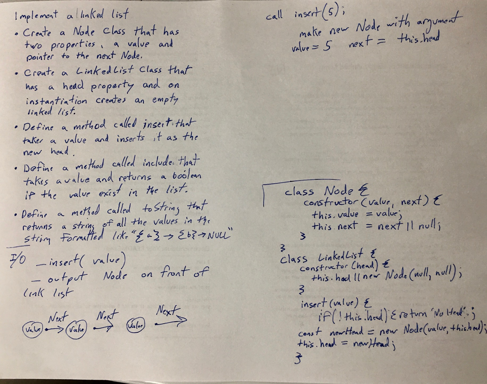

# Singly Linked List
<!-- Short summary or background information -->
Implement a Linked List

## Challenge
<!-- Description of the challenge -->
- Create Node Class that has two properties, a value and pointer to the next Node.
- In LinkedList Class have a head property and on instantiation create an empty linked list.
- Define a method called insert that takes a value and inserts it as the head with O(1) time performance
- Define a method called include which takes a value and returns a boolean of that values existance in the linked list
- Define a method called toString which returns a string of all the values in the string formated like; `"{ a } -> { b } -> { c } -> NULL"`

## Approach & Efficiency
<!-- What approach did you take? Why? What is the Big O space/time for this approach? -->

## API
<!-- Description of each method publicly available to your Linked List -->

- insert
- includes
- toString

*With from TA (allister)*

