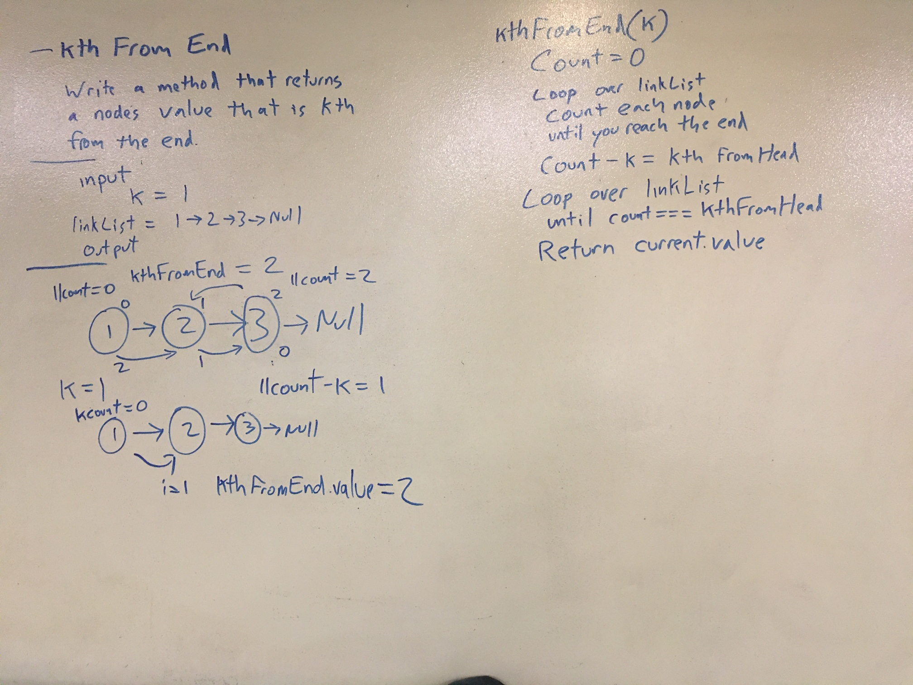

# Linked List Kth From End
<!-- Short summary or background information -->
Write a method that takes a number and returns the value of the node that number from the end.

## Challenge
<!-- Description of the challenge -->
- [x] retrieve kth from end of list
- [] Testing
  - [x] Can successfully retrieve kth from end of list in a simple list
  - [] Can successfully retrieve kth from end when kth is the head
  - [] Can successfully retrieve kth from end when kth is the tail
  - [] Can successfully return undefined with kth from end when kth in not on list

## Approach & Efficiency
<!-- What approach did you take? Why? What is the Big O space/time for this approach? -->

Count the linked lists length by looping over it.  Calc the Count-k, then loop over the list and return current value when loop is === to count-k

O of time might be O(n^2)

## API
<!-- Description of each method publicly available to your Linked List -->

kthFromEnd(k)

