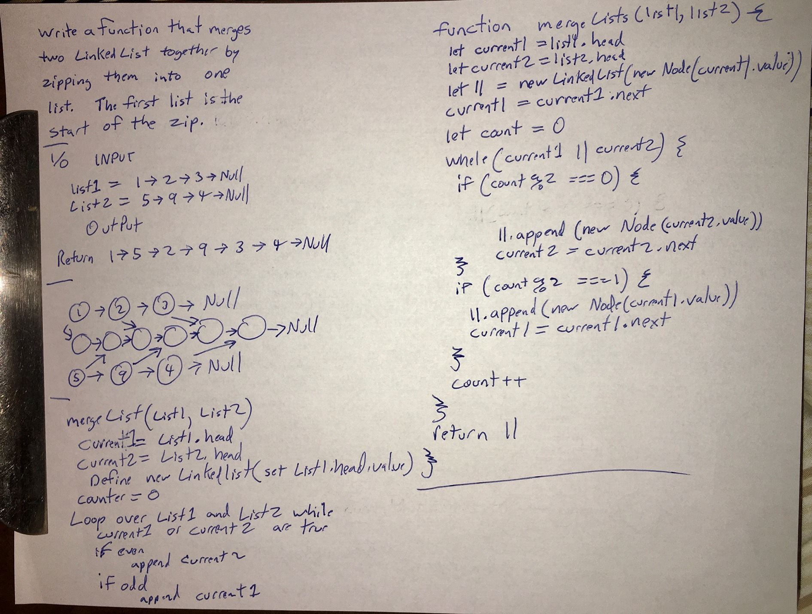

# Linked List Merge Lists
<!-- Short summary or background information -->
Write a method that takes in 2 Linked Lists and Zips the two lists together

## Challenge
<!-- Description of the challenge -->
Try and keep additional space down to O(1). You have access to the Node class and all the properties on the Linked List class as well as the methods created in previous challenges.

- [x] Zip merge to lists
- [x] Testing
  - [x] Can successfully merge two list of same size
  - [x] Can successfully merge two lists with the first being smaller then the second
  - [x] Can successfully merge two lists with the second being smaller then the first

## Approach & Efficiency
<!-- What approach did you take? Why? What is the Big O space/time for this approach? -->

Using the insert method loop through both list simultanously inserting the first on odd loop interations and second on even.  Output new linked list.

Space = O(n)
Time = O(n^2) = O(n*n)  because of append I loop through the result list everytime I append.

I think I could reduce this by first building the final link list in an array then loop over the array backward and insert into a linked list

I think this is O(n)

## API
<!-- Description of each method publicly available to your Linked List -->
mergeLists(LinkedList,LinkedList) Output ---> LinkedList

