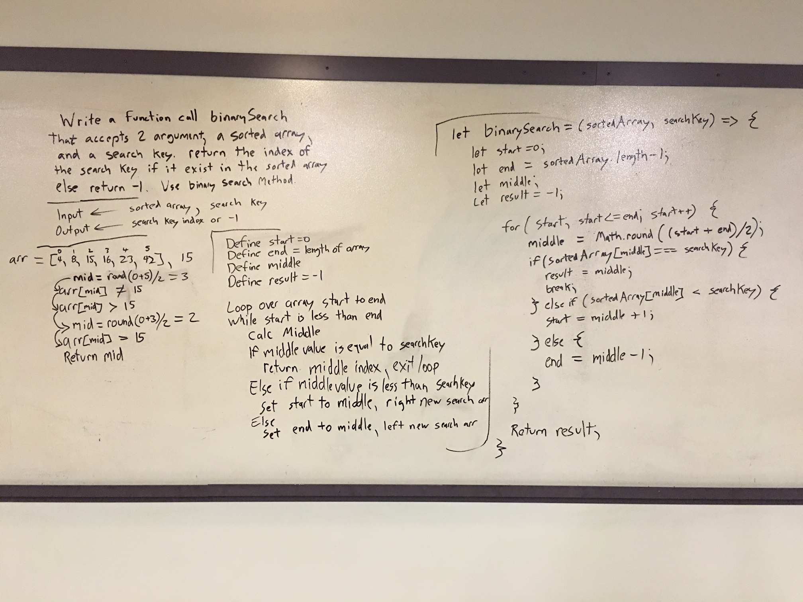

# Challenge Summary
<!-- Short summary or background information -->
Return the index of an array for a search key.

## Challenge Description
<!-- Description of the challenge -->
Write a function called binarySearch that has 2 arguments, a sorted array
and a search key, with built-ins return the index of the array is equal to the searchKey
If the element doesn't exist return -1

## Approach & Efficiency
<!-- What approach did you take? Why? What is the Big O space/time for this approach? -->
helped by https://www.geeksforgeeks.org/binary-search-in-javascript/
Input <--- sorted array, searchKey

Output <--- number, the index of the searchKey or -1

Define start set to 0
Define end set to length of sort array
Define middle
Define result and set equal to -1

Loop over the array start to end while start is less end,
  Calculate the middle,
  If middle index is equal, return middle index, and exit loop.
  Else if middle index value is less than searchKey,
    Set start to middle, making the right side the new search area
  Else,
Return result

## Solution
<!-- Embedded whiteboard image -->

[binary Search pull request](https://github.com/astrokd/data-structures-and-algorithms/pull/33)

 - [x] Top-level README “Table of Contents” is updated
 - [x] Feature tasks for this challenge are completed
 - [x] Unit tests written and passing
     - [x] “Happy Path” - Expected outcome
     - [x] Expected failure
     - [ ] Edge Case (if applicable/obvious)
 - [x] README for this challenge is complete
     - [x] Summary, Description, Approach & Efficiency, Solution
     - [x] Link to code
     - [x] Picture of whiteboard
