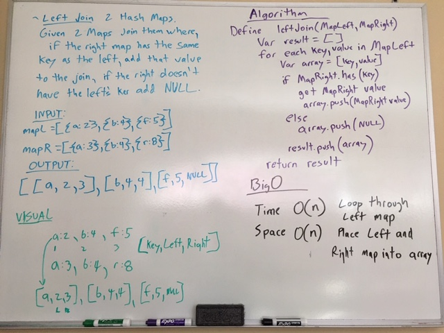

# Hashmap Left Join
<!-- Short summary or background information -->
Implement a simplified LEFT JOIN for 2 Hashmaps.

## Challenge
<!-- Description of the challenge -->

- [x] - White Board
- [x] - Code
- [x] - Write working code

## White Board

[PR for challenge](https://github.com/astrokd/data-structures-and-algorithms/pull/54)
