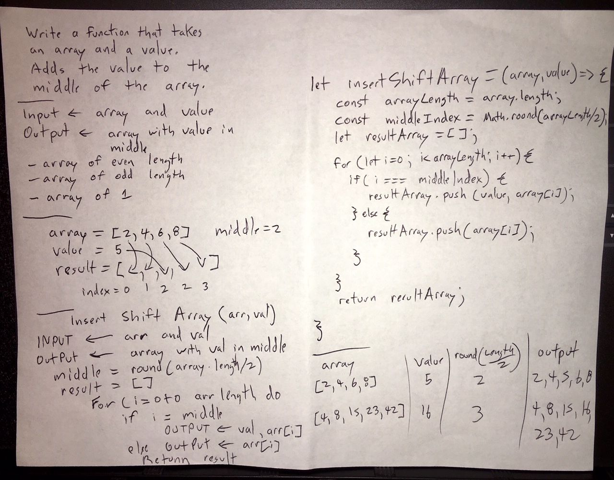

# Challenge Summary
<!-- Short summary or background information -->
Place a value in the middle of an array

## Challenge Description
<!-- Description of the challenge -->
Write a function that takes an array and a value to add to the array and addes the value to the middle of the array.
If the array length is a odd length round up and add the value.

## Approach & Efficiency
<!-- What approach did you take? Why? What is the Big O space/time for this approach? -->
I calculated the array middle by getting the length, halved it and round that number up incase the length was odd.  Then loop through the array and push the new value at index equal the calculated middle I first push the value the push the array. 

## Solution
<!-- Embedded whiteboard image -->
